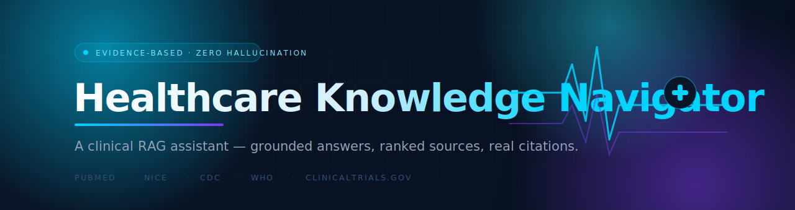
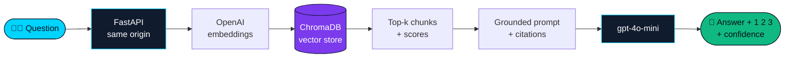

<!-- ╔══════════════════════════════════════════════════════════════╗ -->
<!--                        BANNER                                    -->
<!-- ╚══════════════════════════════════════════════════════════════╝ -->

<p align="center">
  
</p>

<p align="center">
  
</p>

<!-- ╔══════════════════════════════════════════════════════════════╗ -->
<!--                        BADGES                                    -->
<!-- ╚══════════════════════════════════════════════════════════════╝ -->

<p align="center">
  
  
  
  
  
</p>

<p align="center">
  
  
  
  
</p>

<!-- ╔══════════════════════════════════════════════════════════════╗ -->
<!--                     LIVE DEMO BUTTON                             -->
<!--  👉 After deploying on Vercel, replace YOUR_VERCEL_URL below.    -->
<!-- ╚══════════════════════════════════════════════════════════════╝ -->

<p align="center">
  <a href="https://rag-medical-assistant-five.vercel.app">
    
  </a>
  &nbsp;
  <a href="#-quick-start">
    
  </a>
</p>

<p align="center"><sub>🔗 <b>Live demo link:</b> <code>https://rag-medical-assistant-five.vercel.app</code></sub></p>

<p align="center">
  <a href="#-why-this-exists">Why</a> ·
  <a href="#-features">Features</a> ·
  <a href="#-how-it-works">How it works</a> ·
  <a href="#-quick-start">Quick start</a> ·
  <a href="#-deploy-to-vercel">Deploy</a> ·
  <a href="#-roadmap">Roadmap</a>
</p>

---

## 💡 Why this exists

Plain chatbots **hallucinate** — they invent drug doses and fake citations from memory. That's a dealbreaker in medicine.

**Healthcare Knowledge Navigator** answers *only* from a verified corpus of clinical guidelines. Every claim carries a `[1]` citation you can click and inspect, every source is ranked, and a confidence meter flags weak evidence. If it doesn't know, it **says so** instead of guessing.

> It's not a know-everything bot — it's a **trustworthy librarian**. 📚

<br/>

<table>
<tr>
<td width="50%" valign="top">

### 🧠 The problem
- LLMs answer from memory → invented facts & citations
- No way to trace *where* an answer came from
- "Confidence" is invisible
- Classic setups die with a vague **`unable to fetch`**

</td>
<td width="50%" valign="top">

### ✅ This build
- Answers grounded in retrieved guideline text only
- Clickable `[n]` citations → exact source snippet
- Live confidence meter + evidence levels
- **Same-origin architecture → `unable to fetch` can't happen**

</td>
</tr>
</table>

---

## ✨ Features

| | Feature | Detail |
|---|---|---|
| 🎯 | **Citation-grounded RAG** | Answers cite `[1] [2]` mapped to real source chunks |
| 📊 | **Confidence signal** | Color-coded meter: 🟢 HIGH · 🟡 MEDIUM · 🔴 INSUFFICIENT |
| 🔍 | **Ranked evidence panel** | Match %, evidence level, year, click-to-expand source |
| 🧭 | **Auto topic discovery** | Site reads its own index → shows *exactly* what it can answer |
| 🛡️ | **Zero-hallucination prompt** | Refuses to answer outside the provided sources |
| 🎨 | **Motion-design UI** | Custom magnetic cursor, 3D tilt, parallax mesh, scroll reveals |
| ⚡ | **One-server design** | FastAPI serves the page *and* the API → no CORS, no fetch errors |
| ♿ | **Accessible** | Full `prefers-reduced-motion` fallback |

---

## 🏗️ How it works



**The reliability trick:** the browser loads the page *from FastAPI itself* and calls the API with **relative paths** (`/api/chat`). Same origin → CORS can never block it. Every backend error is caught and returned as readable JSON the UI displays — so you always see the real reason, never a blank `unable to fetch`.

---

## 🧰 Tech stack

<p align="center">
  
  
  
  
  
  
  
  
</p>

| Layer | Choice | Why |
|---|---|---|
| **Embeddings** | `text-embedding-3-small` | Lightweight, no local `torch`/GPU |
| **Vector DB** | ChromaDB (local file) | Zero infra — no Docker, no server |
| **LLM** | `gpt-4o-mini` | Cheap, fast, reliable formatting |
| **Backend** | FastAPI + Uvicorn | Async, serves UI + API together |
| **Frontend** | Vanilla HTML/CSS/JS | No build step, premium motion design |

---

## ⚡ Quick start

> **Prereq:** Python 3.10+ and an [OpenAI API key](https://platform.openai.com/api-keys).

```bash
# 1 — clone
git clone https://github.com/AYuSh/healthcare-knowledge-navigator.git
cd healthcare-knowledge-navigator/backend

# 2 — environment
python -m venv .venv
# Windows:
.venv\Scripts\activate
# macOS/Linux:
# source .venv/bin/activate

pip install -r requirements.txt

# 3 — add your key
copy .env.example .env        # macOS/Linux: cp .env.example .env
#   → open .env and paste your key (starts with sk-)

# 4 — build the knowledge base
python ingest.py

# 5 — run  →  http://127.0.0.1:8000
uvicorn main:app --reload
```

<details>
<summary><b>🩺 The status dot tells you everything (click to expand)</b></summary>

<br/>

| Dot | Meaning | Fix |
|---|---|---|
| 🟢 green | online, data indexed | — |
| 🟠 amber | server up, **no data** | run `python ingest.py` |
| 🔴 red — *no key* | key missing/invalid | paste key into `backend/.env`, restart |
| 🔴 red — *offline* | server not running | start `uvicorn main:app --reload` |

If a query fails, the chat shows the **real reason** (quota, bad model name, etc.) — never a generic error.

</details>

<details>
<summary><b>📁 Project structure (click to expand)</b></summary>

```
healthcare-knowledge-navigator/
├── assets/
│   └── banner.svg            # this README's banner
├── backend/
│   ├── main.py               # FastAPI: serves UI + /api/health, /api/topics, /api/chat
│   ├── rag.py                # chunk → embed → Chroma retrieve → answer
│   ├── ingest.py             # build the vector store from data/
│   ├── config.py             # reads .env (never crashes if key is missing)
│   ├── data/*.md             # sourced clinical guideline snippets
│   ├── requirements.txt
│   └── .env.example
├── frontend/
│   ├── index.html            # motion-design single page
│   ├── style.css             # design system + animations
│   └── app.js                # chat, evidence panel, cursor, tilt, reveals
└── WORKING_PLAN_v2.md         # the lean, reviewed plan
```

</details>

<details>
<summary><b>🧠 Add your own topics (click to expand)</b></summary>

<br/>

The assistant only knows what you feed it. To teach it a new topic, drop a Markdown file in `backend/data/` with a small header:

```markdown
---
source: NICE NG28
title: Type 2 diabetes in adults — management
year: 2022
evidence_level: A
url: https://www.nice.org.uk/guidance/ng28
---

Your guideline text here...
```

Then re-index — the website's **"Specialised in"** list updates itself automatically:

```bash
python ingest.py
```

</details>

---

## 🚀 Deploy to Vercel

This repo is Vercel-ready (includes the `pysqlite3-binary` patch ChromaDB needs on serverless).

1. Push to GitHub.
2. Import the repo on [vercel.com](https://vercel.com/new).
3. Add an environment variable: `OPENAI_API_KEY`.
4. Deploy → copy your URL.
5. **Paste that URL into this README** (the Live Demo button + the link line near the top).

> ℹ️ Note: serverless filesystems are read-only, so build the Chroma index at deploy time or ship a prebuilt `chroma_store/` — see `WORKING_PLAN_v2.md` for the production data path.

---

## 🗺️ Roadmap

- [x] MVP: grounded RAG + citations + confidence
- [x] Motion-design UI (cursor, tilt, parallax, reveals)
- [x] Auto topic discovery from the index
- [ ] Token-by-token streaming (SSE)
- [ ] Hybrid search (BM25 + dense) + reranking
- [ ] UMLS / MeSH query expansion
- [ ] NLI-based confidence (DeBERTa)
- [ ] RAGAS evaluation harness

---

## ⚠️ Disclaimer

The bundled `data/` snippets are short, illustrative summaries for demonstrating the pipeline. **This is a software demo, not a clinical tool** — do not use it for real patient decisions. Replace `data/` with your own verified corpus before any serious use.

---

<p align="center">
  <sub>Built with ☕ and a lot of <code>print()</code> by <b>AYuSh</b> · Thāne, Maharashtra 🇮🇳</sub><br/>
  <sub>⭐ Star this repo if the citation-grounded approach helped you.</sub>
</p>

<p align="center">
  
  
</p>
